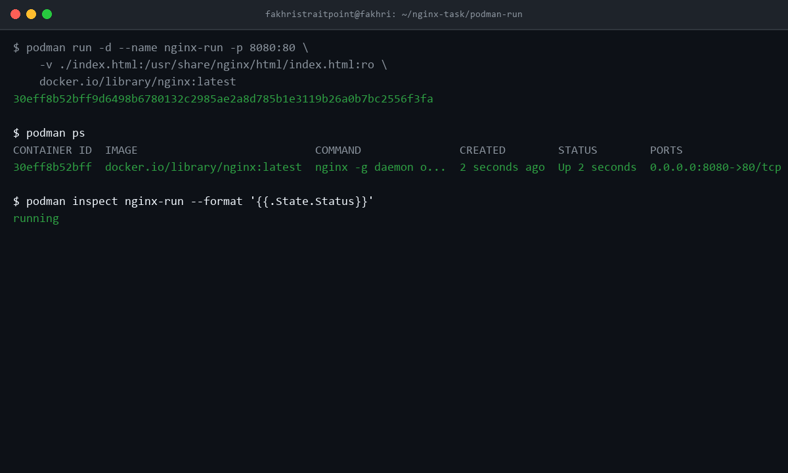
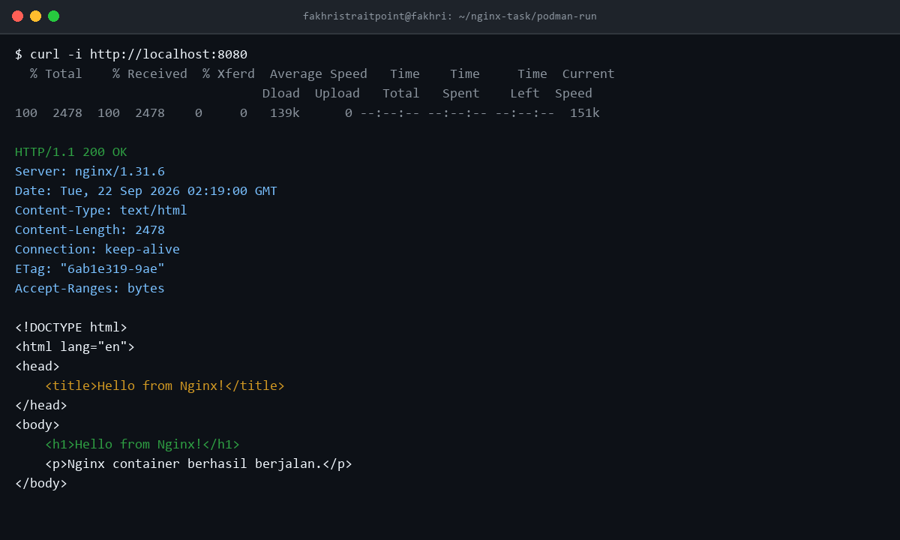
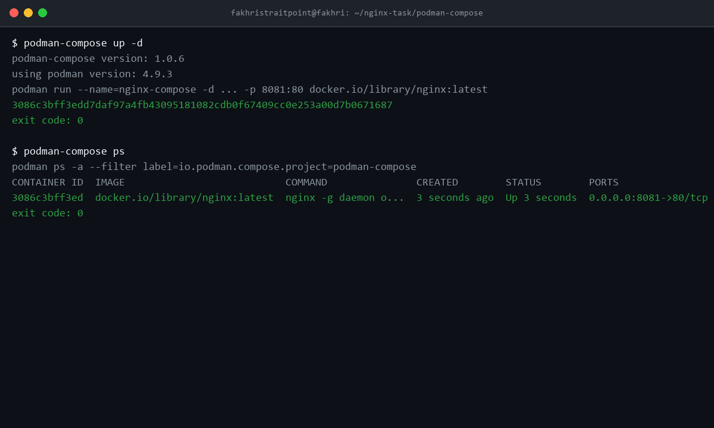
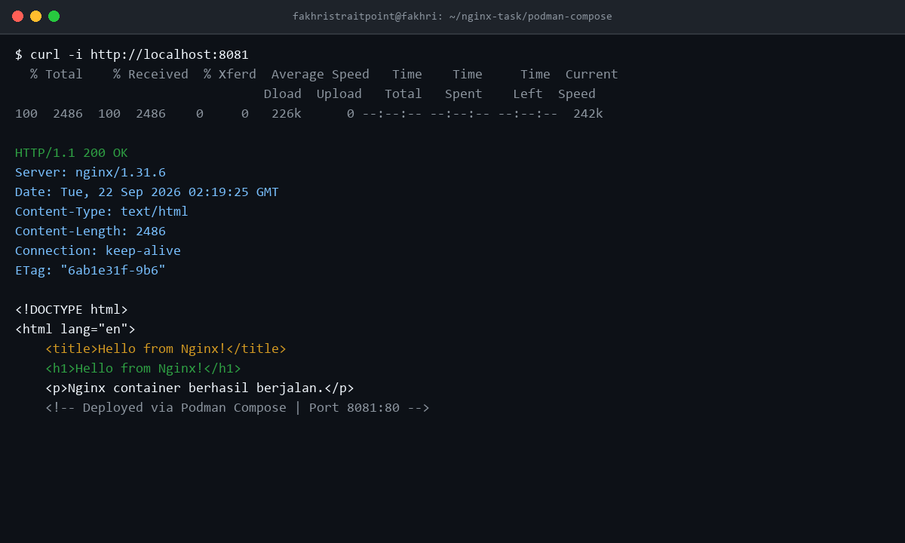
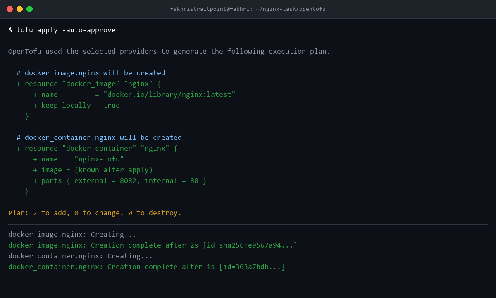
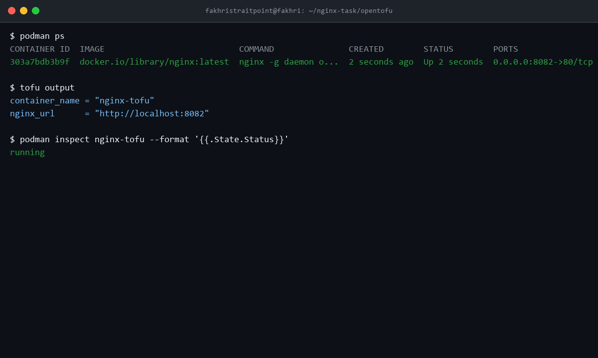

# Nginx Container Deployment: Podman Run, Podman Compose & OpenTofu

Dokumentasi lengkap deployment web server **Nginx** dengan custom `index.html` menggunakan tiga metode berbeda pada environment Linux (WSL 2 Ubuntu 24.04 LTS).

| Metode | Port | Container Name |
|---|---|---|
| Podman Run | `8080:80` | `nginx-run` |
| Podman Compose | `8081:80` | `nginx-compose` |
| OpenTofu | `8082:80` | `nginx-tofu` |

---

## Struktur Repository

```text
nginx-task/
├── README.md
├── podman-run/
│   └── index.html
├── podman-compose/
│   ├── compose.yaml
│   └── index.html
├── opentofu/
│   ├── main.tf
│   ├── versions.tf
│   └── index.html
└── screenshots/
    ├── podman-run-container.png
    ├── podman-run-curl.png
    ├── podman-compose-container.png
    ├── podman-compose-curl.png
    ├── opentofu-apply.png
    ├── opentofu-container.png
    └── opentofu-curl.png
```

---

## Persiapan Environment

### Prasyarat

- **OS**: Linux atau WSL 2 Ubuntu 24.04 LTS
- **Tools yang diperlukan**:
  - `podman` ≥ 4.9
  - `podman-compose` ≥ 1.0
  - `opentofu` ≥ 1.6
  - `curl`

### Instalasi di Ubuntu / WSL Ubuntu

```bash
# 1. Update package list
sudo apt-get update

# 2. Install Podman dan Podman Compose
sudo apt-get install -y podman podman-compose

# 3. Install OpenTofu via official script
curl --proto '=https' --tlsv1.2 -fsSL https://get.opentofu.org/install-opentofu.sh \
  -o /tmp/install-opentofu.sh
sudo sh /tmp/install-opentofu.sh --install-method deb

# 4. Verifikasi versi
podman --version          # podman version 4.9.3
podman-compose --version  # podman-compose version 1.0.6
tofu --version            # OpenTofu v1.12.6

# 5. Aktifkan Podman socket (dibutuhkan untuk OpenTofu)
systemctl --user enable --now podman.socket
ls -la /run/user/$(id -u)/podman/podman.sock
```

---

## Task 1 — Podman Run

### Deskripsi

Deploy container Nginx menggunakan perintah `podman run` secara langsung dengan bind mount file `index.html`.

### Langkah Deployment

```bash
# Pindah ke direktori podman-run
cd nginx-task/podman-run

# Jalankan container Nginx
podman run -d \
  --name nginx-run \
  -p 8080:80 \
  -v ./index.html:/usr/share/nginx/html/index.html:ro \
  docker.io/library/nginx:latest
```

**Penjelasan flag:**
| Flag | Keterangan |
|---|---|
| `-d` | Jalankan container di background (detached mode) |
| `--name nginx-run` | Beri nama container `nginx-run` |
| `-p 8080:80` | Map port host 8080 ke port container 80 |
| `-v ./index.html:...` | Bind mount `index.html` custom ke direktori web Nginx |
| `:ro` | Mount sebagai read-only |

### Verifikasi Container Berjalan

```bash
# Cek status container
podman ps

# Output yang diharapkan:
# CONTAINER ID  IMAGE                    COMMAND          STATUS        PORTS                 NAMES
# 30eff8b52bff  docker.io/library/nginx  nginx -g ...     Up X seconds  0.0.0.0:8080->80/tcp  nginx-run
```

### Testing dengan curl

```bash
curl -i http://localhost:8080
```

**Expected output:**
```
HTTP/1.1 200 OK
Server: nginx/1.31.6
Content-Type: text/html
...
<h1>Hello from Nginx!</h1>
<p>Nginx container berhasil berjalan.</p>
```

### Cleanup

```bash
# Stop container
podman stop nginx-run

# Hapus container
podman rm nginx-run

# Verifikasi tidak ada container yang berjalan
podman ps
```

---

## Task 2 — Podman Compose

### Deskripsi

Deploy Nginx menggunakan `podman-compose` dengan file konfigurasi `compose.yaml`.

### File: `podman-compose/compose.yaml`

```yaml
services:
  nginx:
    image: docker.io/library/nginx:latest
    container_name: nginx-compose
    ports:
      - "8081:80"
    volumes:
      - ./index.html:/usr/share/nginx/html/index.html:ro
    restart: always
```

### Langkah Deployment

```bash
# Pindah ke direktori podman-compose
cd nginx-task/podman-compose

# Jalankan service
podman-compose up -d
```

### Verifikasi Container Berjalan

```bash
# Cek status via podman-compose
podman-compose ps

# Atau langsung via podman
podman ps --filter name=nginx-compose
```

### Testing dengan curl

```bash
curl -i http://localhost:8081
```

**Expected output:**
```
HTTP/1.1 200 OK
Server: nginx/1.31.6
...
<h1>Hello from Nginx!</h1>
```

### Cleanup

```bash
# Stop dan hapus semua service di compose
podman-compose down

# Verifikasi
podman ps
```

---

## Task 3 — OpenTofu (Terraform)

### Deskripsi

Deploy Nginx container menggunakan Infrastructure as Code dengan OpenTofu dan provider `kreuzwerker/docker` yang terhubung ke Podman socket.

### File: `opentofu/versions.tf`

```hcl
terraform {
  required_version = ">= 1.6.0"

  required_providers {
    docker = {
      source = "kreuzwerker/docker"
    }
  }
}
```

### File: `opentofu/main.tf`

```hcl
variable "podman_socket" {
  type        = string
  description = "Path to Podman or Docker UNIX socket"
  default     = "unix:///run/user/1000/podman/podman.sock"
}

provider "docker" {
  host = var.podman_socket
}

resource "docker_image" "nginx" {
  name         = "docker.io/library/nginx:latest"
  keep_locally = true
}

resource "docker_container" "nginx" {
  image = docker_image.nginx.image_id
  name  = "nginx-tofu"

  ports {
    internal = 80
    external = 8082
  }

  volumes {
    host_path      = "${abspath(path.module)}/index.html"
    container_path = "/usr/share/nginx/html/index.html"
    read_only      = true
  }
}

output "container_name" {
  value       = docker_container.nginx.name
  description = "Nama container Nginx yang dideploy"
}

output "nginx_url" {
  value       = "http://localhost:8082"
  description = "URL untuk mengakses Nginx"
}
```

> **Catatan**: Pastikan Podman socket aktif sebelum menjalankan OpenTofu:
> ```bash
> systemctl --user enable --now podman.socket
> ```
> Jika UID user bukan `1000`, sesuaikan nilai `podman_socket`:
> ```bash
> tofu apply -var="podman_socket=unix:///run/user/$(id -u)/podman/podman.sock"
> ```

### Workflow OpenTofu

#### Inisialisasi

```bash
cd nginx-task/opentofu

# Download provider kreuzwerker/docker
tofu init
```

Output yang diharapkan:
```
Initializing provider plugins...
- Installing kreuzwerker/docker v4.6.0... (signed, key ID 0DCE698927DAF8EC)

OpenTofu has been successfully initialized!
```

#### Perencanaan

```bash
tofu plan
```

Output yang diharapkan:
```
Plan: 2 to add, 0 to change, 0 to destroy.

Changes to Outputs:
  + container_name = "nginx-tofu"
  + nginx_url      = "http://localhost:8082"
```

#### Deployment

```bash
tofu apply -auto-approve
```

Output yang diharapkan:
```
docker_image.nginx: Creating...
docker_image.nginx: Creation complete after 2s
docker_container.nginx: Creating...
docker_container.nginx: Creation complete after 1s

Apply complete! Resources: 2 added, 0 changed, 0 destroyed.

Outputs:
  container_name = "nginx-tofu"
  nginx_url      = "http://localhost:8082"
```

### Verifikasi Container Berjalan

```bash
# Cek via podman ps
podman ps

# Cek output OpenTofu
tofu output
```

### Testing dengan curl

```bash
curl -i http://localhost:8082
```

**Expected output:**
```
HTTP/1.1 200 OK
Server: nginx/1.31.6
...
<h1>Hello from Nginx!</h1>
```

### Cleanup

```bash
# Destroy semua resource yang dibuat OpenTofu
tofu destroy -auto-approve
```

Output yang diharapkan:
```
docker_container.nginx: Destroying...
docker_container.nginx: Destruction complete after 1s
docker_image.nginx: Destroying...
docker_image.nginx: Destruction complete after 0s

Destroy complete! Resources: 2 destroyed.
```

---

## Perbandingan Ketiga Metode

| Aspek | Podman Run | Podman Compose | OpenTofu |
|---|---|---|---|
| **Kompleksitas** | Rendah | Menengah | Tinggi |
| **File Konfigurasi** | Tidak ada | `compose.yaml` | `main.tf`, `versions.tf` |
| **Reproducibility** | Manual | Deklaratif | IaC (state-managed) |
| **State Management** | Tidak ada | Tidak ada | `terraform.tfstate` |
| **Cocok untuk** | Testing cepat | Development | Production / CI-CD |
| **Multi-container** | Sulit | Mudah | Mudah |
| **Port** | `8080:80` | `8081:80` | `8082:80` |

---

## Evidence

### Task 1 — Podman Run

#### Container berjalan



#### Curl test HTTP 200



---

### Task 2 — Podman Compose

#### Container berjalan



#### Curl test HTTP 200



---

### Task 3 — OpenTofu

#### tofu apply berhasil



#### Container berjalan



#### Curl test HTTP 200


